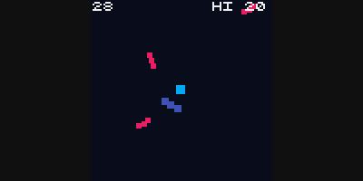
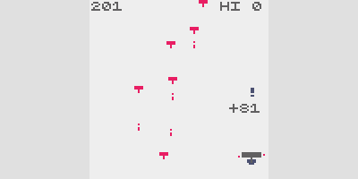
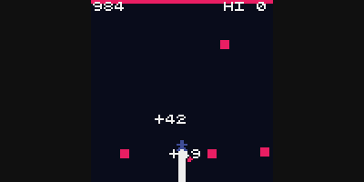
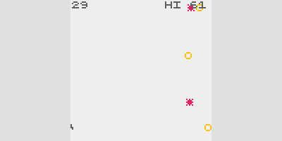
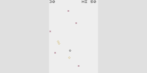

# one-button-game-builder

The ONE BUTTON GAME BUILDER is a tool powered by [GPTs](https://openai.com/blog/introducing-gpts) that facilitates the creation of one-button action mini-games using the [crisp-game-lib](https://github.com/abagames/crisp-game-lib) framework. It operates by following a series of steps to interact with the user and generate a custom game based on their input.

- [ONE BUTTON GAME BUILDER]()

# Examples of Built Games

Click the image below to play directly in the browser.

# How it Works

The ONE BUTTON GAME BUILDER is equipped with the following [description](./description.txt):

> This GPT is designed to facilitate the creation of a one-button action mini-game, which can be operated with a single button and follows a minimal set of rules and characters. The conversation with the user will be structured in 10 steps:
>
> 1. Ask the user for the theme of the game.
> 2. Read the entire contents of two files, 'one_button.md' and 'ideas.md'. Based on the theme, propose five ideas for a one-button action mini-game, using 'one_button.md' for reference on the button's action. Present the decided action for the one-button in each game idea. Refer to 'ideas.md' for methods of creating ideas.
> 3. Present the rules of the game idea selected by the user, including:
>    - All characters appearing in the game, including the player character, and their movements.
>    - Conditions for scoring points.
>    - Conditions for game over.
>    - Changes that occur as the difficulty level increases.
> 4. Read the entire contents of six files: 'bundle.d.ts', 'pinclimb.js', 'thunder.js', 'arcfire.js', 'rwheel.js', 'reflector.js'. 'bundle.d.ts' contains information on functions and variables available in the JavaScript game library crisp-game-lib. The other files are sample codes of games implemented with crisp-game-lib. Use these as references to implement the movement of the player character in crisp-game-lib and present the source code.
> 5. Add the movements of other characters to the source code.
> 6. Implement score addition using the `addScore()` function.
> 7. Implement game over processing using the `end()` function.
> 8. Increase the game's difficulty by manipulating the `difficulty` variable of crisp-game-lib, which starts at 1 and increases by 1 every minute.
> 9. Add sound effects using the `play()` function.
> 10. Once the game implementation is complete, present the entire source code.

Additionally, [knowledge](./knowledge/) is provided, including texts for brainstorming one-button action mini-game ideas, and type definition files for functions and variables in crisp-game-lib, along with sample game codes.

Users provide a game theme to the ONE BUTTON GAME BUILDER, which then generates five mini-game ideas based on the theme. Users select their preferred idea by number. Then, the game's rules and corresponding code are sequentially output. If users wish to modify the rules or code, they can provide instructions accordingly.

It may be challenging to output fully functional code with the ONE BUTTON GAME BUILDER. Once a reasonably valid code is generated, it's recommended to copy it into an editor and perform manual adjustments.

For example, the following is a conversation with the ONE BUTTON GAME BUILDER when Laser Deflection was created.

- [Game Theme Discussion](https://chat.openai.com/share/632fb7ad-d5f9-4d62-8bc8-87169e9ce034)

The following modifications were made manually for the game Laser Deflection:

- Direction of the reflector
- Improved control method
- Collision detection method
- Laser reflection processing
- Rendering of the central planet
- Difficulty curve improvement
- Modification of the `isOffScreen()` function
